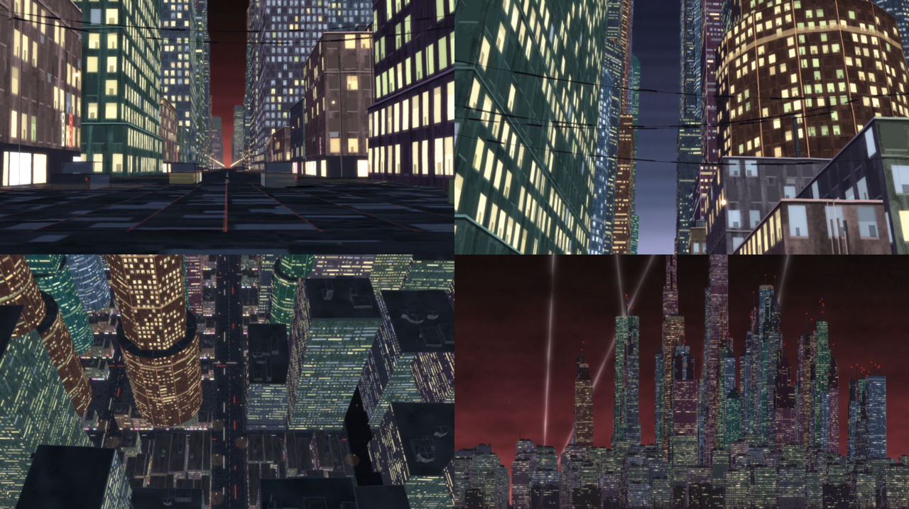
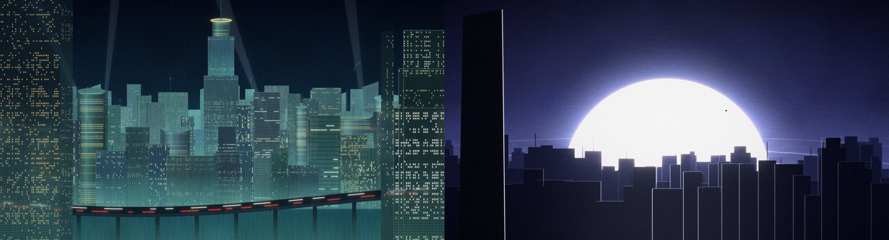
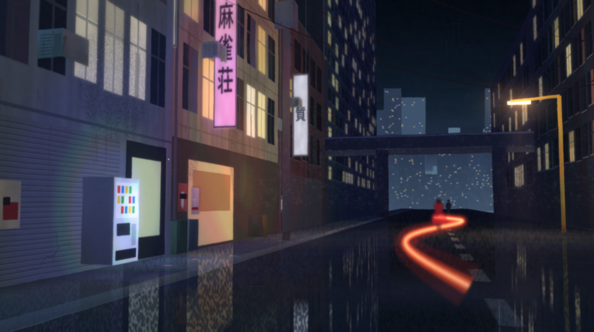
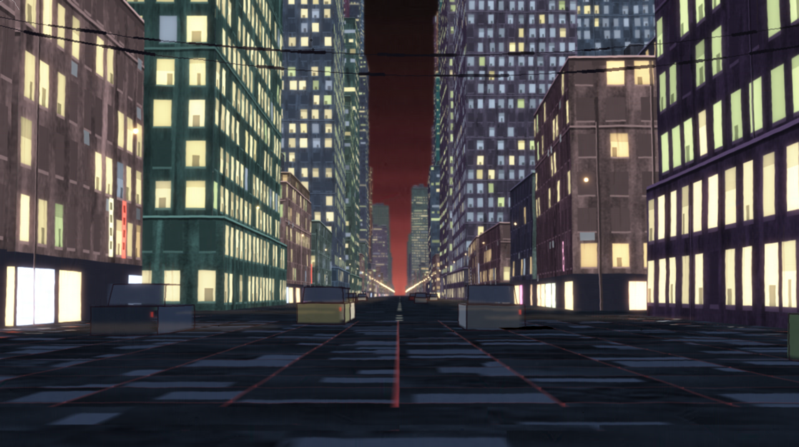
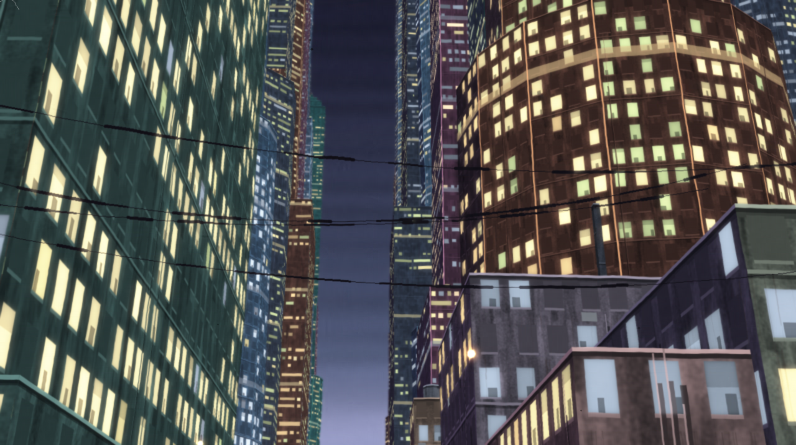
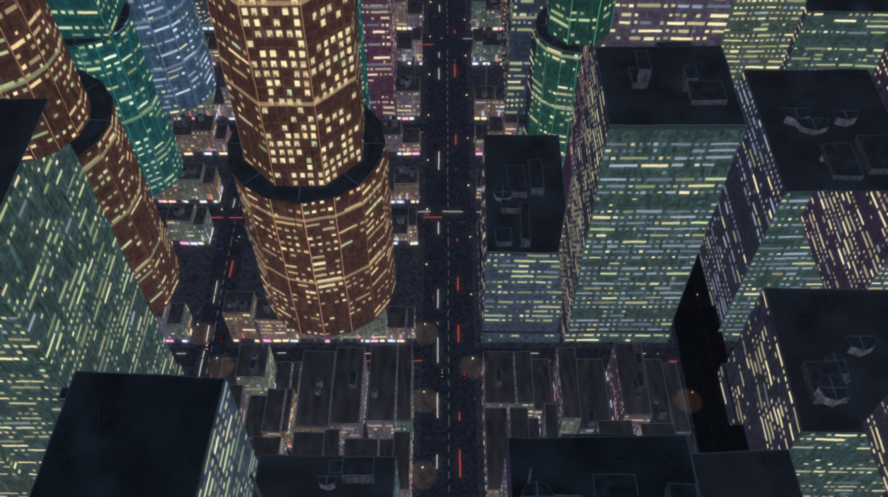
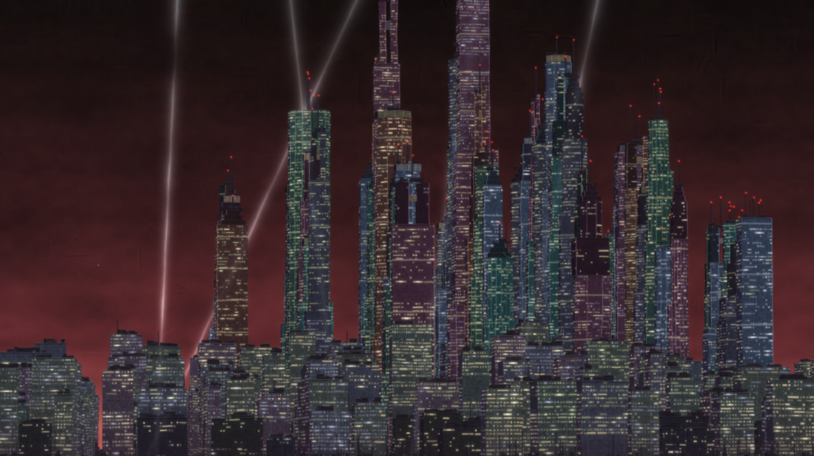
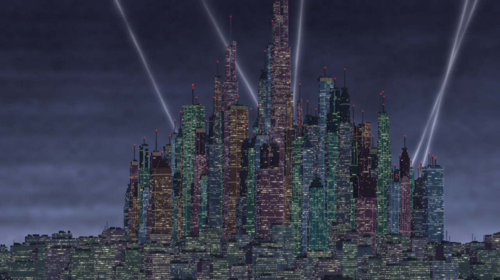

# anime with claude

Can anime frames that look hand-painted be made entirely in code, with no image
models, no 3D packages, and no traced footage? This repository is a working log
of trying, built in collaboration with Claude. It contains a cel-paint engine, a
tool that turns a still into editable scene code, a set of original frames, and
an original procedurally generated megacity in the style of *Akira* (1988).
Blind AI critics score every result.



## Results at a glance

The short version: reconstructing an existing frame as code works well, but
original frames don't yet pass as the real thing.

| Experiment | What it tried | Result |
| --- | --- | --- |
| [1. Drawing from scratch](#experiment-1-drawing-from-scratch) | Original compositions drawn from hand-placed curves | Read as "anime", not as the target film |
| [2. Rebuilding real frames](#experiment-2-rebuilding-real-frames-as-code) | A still rebuilt as layered scene code: airbrush mesh, cel paths, ink strokes | Mean color error ΔE 0.7 to 2.0, below the threshold most people notice |
| [3. Original frames, judged blind](#experiment-3-original-frames-judged-blind) | New frames in the same scene format, then a painted 2.5D stage | 2% to 8% judged genuine |
| [4. A whole city](#experiment-4-a-whole-city) | One original city, generated once and shot from many cameras | Mostly 3% to 6% judged genuine, with one skyline at 22% |

Real frames from the film, in the same blind rounds, scored 80% to 98%.

## How it's measured

The blind test in `tools/blind.py` shuffles candidate frames among real frames
from the reference film. It resizes every image to the same size and JPEG
quality, crops letterbox bars, and writes a hidden answer key. A fresh judge
agent, with no knowledge of the project, then sees only that folder. The judge
rates each frame's chance of being genuine and lists the tells. Later rounds
ran two independent judges in parallel.

The judge also turns out to be harsh on real frames: across rounds, genuine
frames ranged from 30% to 98%. Keep that in mind when you read the scores.

## The story so far

Four experiments, each one set up by what the one before it taught. "We" is
Pranav and Claude, working together.

### Experiment 1: Drawing from scratch

**The idea.** Study the film, write down what makes a frame look like it, and
then draw new compositions in code that follow those rules. The notes are in
`refs/akira/STYLE.md`: night that is never pure black, one hot red in a cold
frame, thin traced lines, hard two-tone shadows, light that glows on the film.

**What we built.** A small cel engine. Shapes are authored as control points on
centripetal Catmull-Rom curves, the way you would place pencil marks. Lines are
inked as tapered strokes with a slight hand wobble, and every frame is shot
through a simulated 35 mm print with gate weave, halation, grain, and dust. The
code is in `engine/core.py`, `engine/ink.py`, `engine/film.py`, and
`studies/akira/`.

**What happened.** The plates looked like anime, but not like the film. The
palette was too clean, the lines too smooth, the drawing too modern. The first
verdict was blunt: "This looks nothing like the anime."

**What it taught us.** Rules written down from watching aren't enough. The work
had to be measured against the real thing, frame by frame.



### Experiment 2: Rebuilding real frames as code

**The idea.** Before drawing anything new, prove the engine can hold a real
frame. Take a still and rebuild it as code, layer by layer, in the order a cel
was made.

**What we built.** `engine/trace.py` reads a still and writes it back out as a
JSON scene with three layers:

- **Airbrush:** a gradient mesh of triangles with per-corner colors.
- **Paint:** cel regions as sub-pixel paths, each with a measured edge
  feather.
- **Ink:** line centerlines with per-point width and color.

The pipeline finds ink with a morphological `black-hat` filter and traces its
skeleton. It then inpaints the ink away, finds the paint palette with k-means
in Lab color space, and traces each region with marching squares. Last, it
runs analysis by synthesis: it renders the scene with `engine/scene.py`,
measures the error inside every shape, corrects that shape's color, and
repeats.

**What happened.** It worked. On five test stills the rebuilt frames reached a
mean CIEDE2000 color error of 0.7 to 2.0, below the level most people notice,
and SSIM of 0.90 to 0.96. At normal size the rebuild and the original are hard
to tell apart. At 2x zoom, fine ink strokes run thin, and JPEG artifacts in the
source get traced as paint.

**What it taught us.** The renderer isn't the bottleneck. When the shapes come
from a real drawing, code can carry them almost perfectly. That left the real
question: can it make shapes of its own?

No reference frames or rebuilds are included in this repository. To try the
tool on your own stills, see [Get started](#get-started).

### Experiment 3: Original frames, judged blind

**The idea.** Draw new frames in the same scene format, with every default
measured from the reference material (ink color and width, palette, lens
softness, and grain), and let blind critics decide whether they pass. The
critics never know which frames are real; see
[How it's measured](#how-its-measured).

**What we built.** First, a character close-up and a night rooftop drawn
directly as scene code. Then, after the critics called the backgrounds
procedural, a 2.5D painting stage (`engine/stage.py`): every surface is a quad
in 3D, painted flat as a gouache texture (`engine/gouache.py`), lit per texel,
and warped into perspective. The night street that came out of it has signs, a
vending machine, wet reflections, and a tail-light trail.

**What happened.** Every original was caught. Across rounds they scored 2% to
8% genuine, while real frames scored 80% to 98%. The critics named the tells
each time: even linework, computed perspective, procedural texture, and a
modern palette.

**What it taught us.** Background-led shots did better than character
close-ups, and the critics' notes were specific enough to build on. One frame
at a time was too slow to learn from. The next step was to build a whole world
and shoot it many ways.



### Experiment 4: A whole city

**The idea.** Instead of one frame at a time, build an entire original city
once, follow a rule book distilled from the film, then film it from many
cameras and have two critics judge every round.

**What we built.** An analysis agent studied about 1,500 sampled film frames
and wrote `refs/akira/CITY_BIBLE.md`: 37 measurable rules about building
strata, tower shapes, how backgrounds are painted, palettes, camera setups, and
what makes a render look like CG. `engine/citygen.py` then generates a city of
about 38,000 building parts, and `studies/city/shots.py` films it from five
camera setups. The city has:

- Three building strata: grimy low-rise, office slabs, and a core of
  megatowers built from stacked prisms with setbacks, belts, crowns, and spires.
- A hue family per tower, with warm and cool towers alternating.
- Facades painted per shot at their distance class (`engine/facade.py`), with
  gouache brush tiles (`engine/brushtex.py`) and hand-placed windows.
- Haze in discrete planes that glows from the street, expressways on teal
  piers, rooftop plant, billboards with invented brand names, and inked cel
  traffic.

Nothing in the city copies a building or character from any film.

**What happened.** Over five rounds, most shots stayed at 3% to 6% genuine,
even as each round fixed what the last one flagged. Telephoto skylines broke
out once, at 22%, then fell back to 4% to 5% when judged directly against the
film's own skylines. The critics' notes got sharper every round, which is what
the next section collects.

**What it taught us.** A 3D camera gives itself away, however good the paint
on top. The skylines, which barely use perspective, came closest.

All of the following frames come from the same generated city.

**Street canyon.** A one-point view down an avenue, with the horizon set low
and the core towers framed between dark near walls.



**Worm's-eye view.** The camera sits at road level and looks up, so the
towers fill the frame.



**Bird's-eye view.** A steep look down a canyon, with drum towers, rooftop
plant, and traffic on the avenue.



**Skyline, crimson night.** A telephoto view of the megatower core, with
searchlights rising from behind the city. Telephoto skylines scored highest
in the blind rounds, peaking at 22% genuine.



**Skyline, violet night.** The same core from a different angle, under a
blue-violet sky.



## What the critics taught us

Across five city rounds and two judges per round, the same tells came back:

- **Computed perspective.** A mathematically exact vanishing point reads as a
  3D render. Telephoto skylines, with almost no convergence, scored highest.
- **Regular window lattices.** Even with jittered sizes and colors, an
  underlying grid shows through.
- **Even light.** Real night backgrounds are mostly near-black, with light
  pooling and bleeding from a few sources.
- **Procedural texture.** Noise reads as noise. A uniform grain overlay made
  scores worse. A brush-stroke repaint pass smeared edges and also made
  them worse.
- **Recognition.** Judges recognize scenes and characters from the real film,
  which gives genuine frames a boost no original frame can earn.

That points to experiment 5: drop the 3D camera, and build frames the way a
multiplane camera stand did, from layered 2D painted flats that slide at
different speeds.

## Get started

You need Python 3.11 or later. `ffmpeg` is optional and only used for MP4
output.

1. Install the dependencies:

   ```bash
   pip install -r requirements.txt
   ```

1. Render the style plates:

   ```bash
   python studies/akira/p01_city.py
   python studies/akira/p04_dome.py
   ```

1. Generate the city and render its shots:

   ```bash
   python studies/city/shots.py canyon skyline
   ```

   Renders go to `out/`, which is gitignored.

Some tools work on reference frames that you supply. They read from folders
that are gitignored, so nothing you add is committed:

| Tool | Reads |
| --- | --- |
| `studies/akira_frames/recreate.py` | Stills in `ref/akira/` named `akira_NNN.jpg` |
| `tools/texbank.py` | Frames in `ref/akira_film/` named `f_NNNNN.jpg`; writes `out/texbank.npz` |
| `tools/blind.py` | Real frames from `ref/akira_film/` to shuffle among your candidates |

Without a texture bank, the print stage falls back to synthetic grain. Sign
lettering looks for a font with Japanese glyphs and falls back to a default
font if none is installed.

## Repository layout

| Path | Contents |
| --- | --- |
| `engine/` | Rendering engine: ink, film print, scene format, vectorizer, 2.5D stage, gouache painting, city generator |
| `studies/` | One folder per experiment: `akira/` (1), `akira_frames/` (2), `akira_originals/` (3), `city/` (4) |
| `tools/` | Blind-test harness and texture-bank builder |
| `refs/akira/` | Written style analysis: `STYLE.md` and `CITY_BIBLE.md` |
| `plates/` | Finished renders, all original work |

## A note on copyright

*Akira* is the work of Katsuhiro Otomo and its rights holders. This repository
contains no frames, stills, or footage from the film, and no reconstructions
of them. The written analysis in `refs/` is commentary on style. Every image
in `plates/` is an original composition made by the code here.
